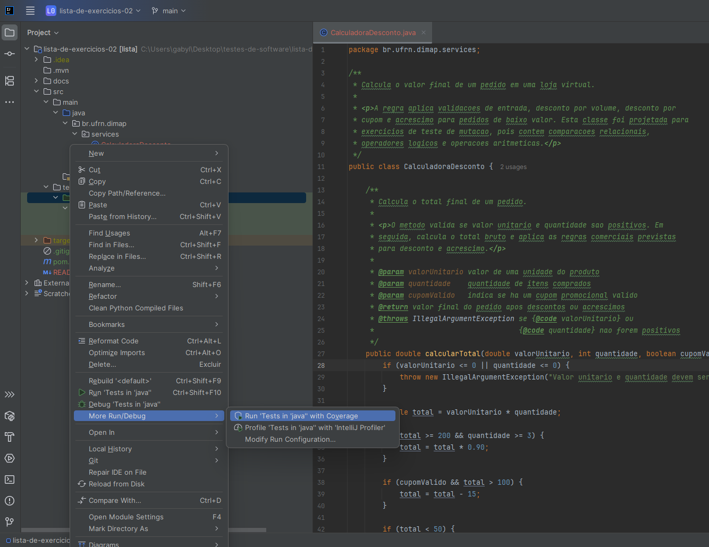
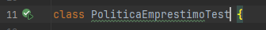
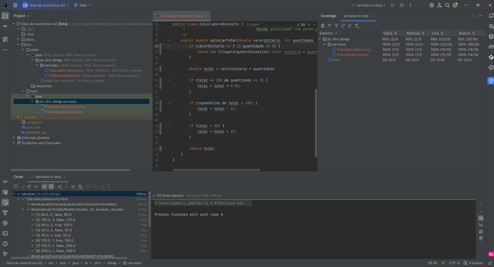
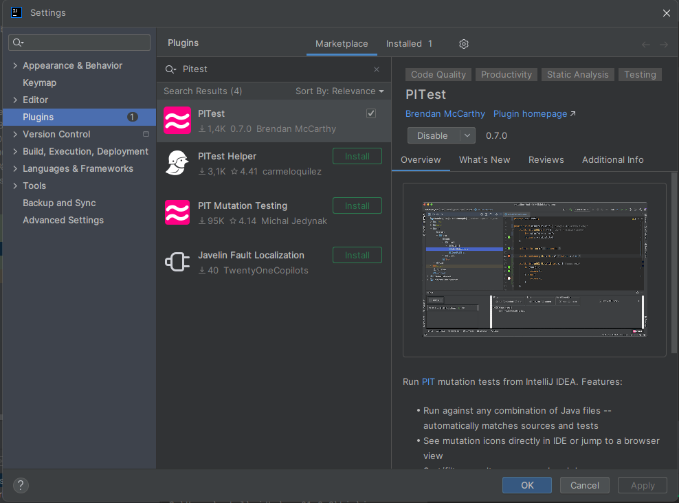
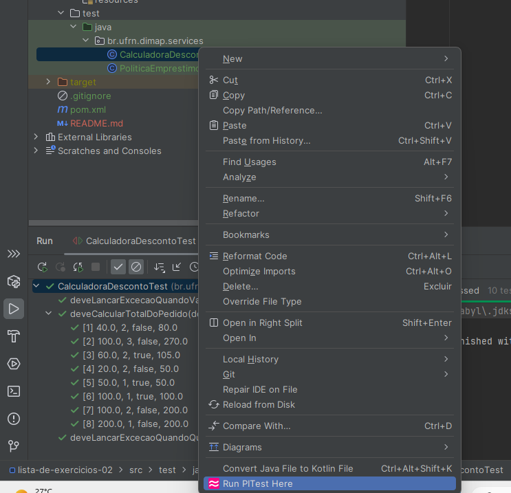
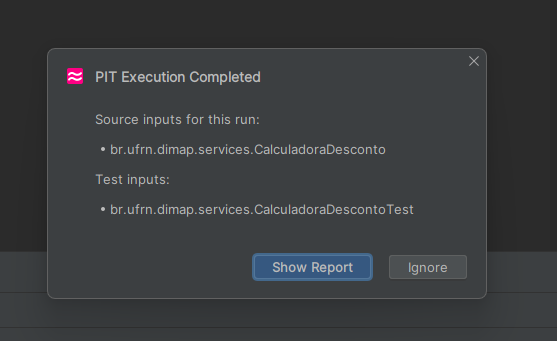
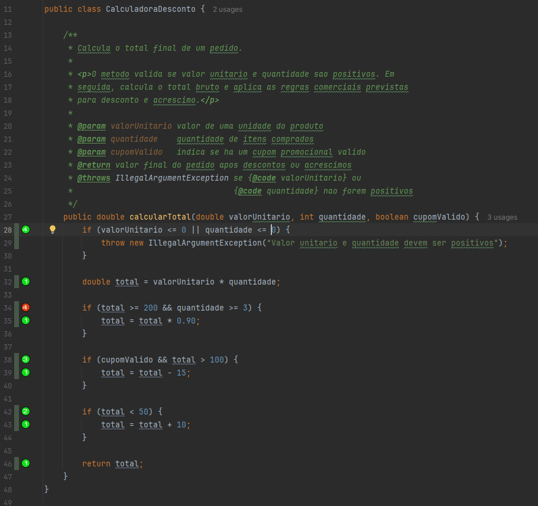

# Tutorial: cobertura de testes e testes de mutação no IntelliJ

Este tutorial explica como verificar a cobertura dos testes no IntelliJ IDEA e como executar testes de mutação usando PITest em um projeto Maven com Java, JUnit 5 e JaCoCo.

## 1. Antes de começar

Verifique se o projeto foi aberto como projeto Maven no IntelliJ:

1. Abra o IntelliJ IDEA.
2. Clique em **File > Open**.
3. Selecione a pasta do projeto.
4. Aguarde o IntelliJ importar as dependências do Maven.

## 2. Executando os testes no IntelliJ

Para executar todos os testes:

1. Abra a pasta `src/test/java`.
2. Clique com o botão direito sobre a pasta de testes.
3. Escolha **Run 'Tests in java'** ou uma opção equivalente de execução dos testes.


Outra opção é abrir uma classe de teste e clique no ícone de play verde ao lado do nome da classe ou de um método de teste:




## 3. Vendo cobertura de testes pelo IntelliJ

Cobertura de testes mostra quais partes do código foram executadas pelos testes.

Para rodar os testes com cobertura:

1. Clique com o botão direito na pasta `src/test/java`.
2. Escolha **More Run/Debug > Run with Coverage**.
3. Aguarde os testes terminarem.
4. O IntelliJ mostrará um resumo de cobertura na janela **Coverage**.

Depois da execução, o próprio editor marca as linhas do código:

- Verde: linha executada pelos testes.
- Vermelho: linha não executada pelos testes.
- Amarelo: linha parcialmente coberta, comum em estruturas condicionais.



## 5. Executando testes de mutação com plugin no IntelliJ

Existe um plugin para IntelliJ chamado **PITest**.

Página do plugin:

```text
https://bmccar.github.io/pitest-idea/
```

Com ele, é possível executar o PITest direto pela IDE. O plugin mostra os resultados dentro do IntelliJ, marca os mutantes no editor e também permite abrir um relatório.

### 5.1. Instalando o plugin

1. No IntelliJ, vá em **File > Settings**.
2. Acesse **Plugins**.
3. Pesquise por **PITest**.
4. Instale o plugin.
5. Reinicie o IntelliJ, se ele pedir.



### 5.2. Rodando o PITest em uma classe

1. Abra uma classe em `src/main/java`, por exemplo:
```text
src/main/java/br/ufrn/dimap/services/CalculadoraDesconto.java
```
2. Clique com o botão direito dentro do editor.
3. Escolha **Run PITest Here**.



4. Aguarde a execução terminar.
5. Quando aparecer o aviso de conclusão, clique em **Show Report**.



Também é possível executar o PITest selecionando arquivos, pacotes ou uma combinação de classes de produção e classes de teste pelo painel do projeto.

O plugin tenta associar automaticamente as classes de produção e as classes de teste usando nomes convencionais, por exemplo:

```text
CalculadoraDesconto.java -> CalculadoraDescontoTest.java
```

### 6.3. O que observar no relatório do plugin

No relatório, procure principalmente por:

- **Killed**: mutantes mortos pelos testes.
- **Survived**: mutantes que sobreviveram.
- **No Coverage**: mutantes em partes do código que os testes não executaram.
- **Mutation Score**: percentual geral de mutantes mortos.

O ponto mais importante é olhar os mutantes marcados como **Survived**. Eles indicam trechos em que os testes ainda não conseguem perceber uma alteração incorreta no código.



Nesse exemplo, um mutante sobreviveu, clicando em cima do 4 é possível identificar o motivo.
