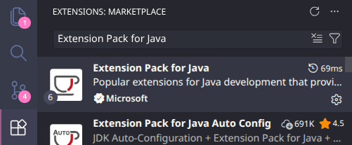
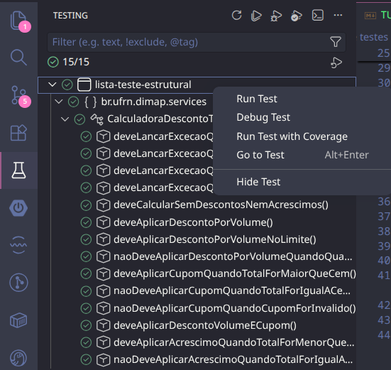
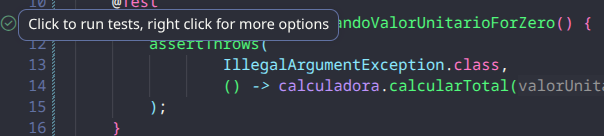
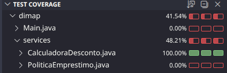
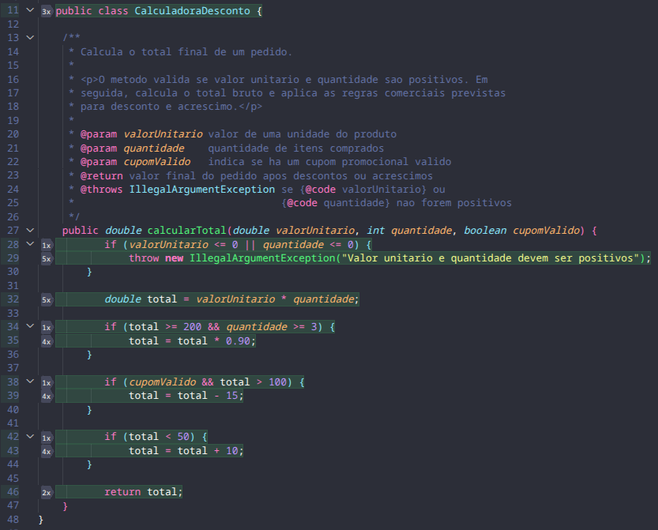
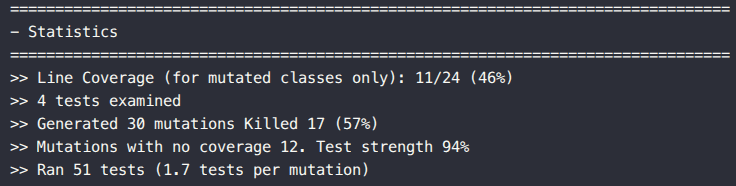
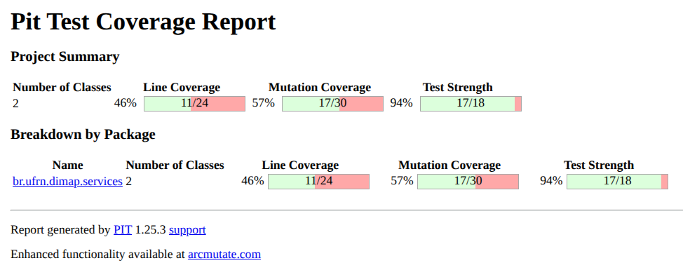
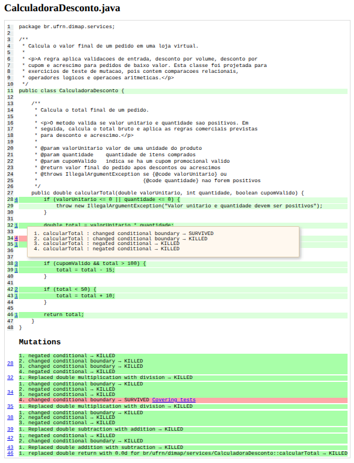

# Tutorial: cobertura de testes e testes de mutação no Visual Studio Code

Este tutorial explica como verificar a cobertura dos testes no Visual Studio Code e como executar testes de mutação usando PITest em um projeto Maven com Java, JUnit 5 e JaCoCo.

## 1. Antes de começar

Verifique se a extensão "Extension Pack for Java" está instalada, disponível no marketplace de extensões na aba à esquerda da interface do VS Code. Caso não, instale-a (é um pacote que consiste em seis extensões).



## 2. Executando os testes no Visual Studio Code

Para executar todos os testes:

1. Na aba à esquerda do VS Code, selecione "Testing", conforme a imagem abaixo.
2. Clique com o botão direito sobre o conjunto de testes que deseja executar ou sobre um teste individual.
3. Escolha **Run Test** ou uma opção equivalente de execução dos testes.  



Outra opção é abrir uma classe de teste e clique no ícone de play verde ao lado do nome da classe ou de um método de teste:




## 3. Vendo cobertura de testes pelo Visual Studio Code

Cobertura de testes mostra quais partes do código foram executadas pelos testes.

Para rodar os testes com cobertura, escolha a opção **Run Test with Coverage** exibida na seção 2 acima desta.

Depois da execução, o próprio editor marca as linhas do código:

- Verde: linha executada pelos testes.
- Vermelho: linha não executada pelos testes.
- Amarelo: linha parcialmente coberta, comum em estruturas condicionais.




## 4. Executando testes de mutação com PITest

Diferentemente do Eclipse e do IntellijJ, não há uma extensão ou plugin que possa ser utilizado para executar o PITest diretamente no VS Code. Assim, utilizaremos o plugin disponibilizado no Maven Repository. Caso deseje ver mais detalhes ou utilizar alguma outra ferramenta além do Maven, consulte o [site oficial](https://pitest.org/quickstart/).

No `pom.xml` do projeto, na parte de plugins, inclua o código a seguir:  

```xml
<plugin>
    <groupId>org.pitest</groupId>
    <artifactId>pitest-maven</artifactId>
    <version>1.25.3</version>

    <dependencies>
        <dependency>
            <groupId>org.pitest</groupId>
            <artifactId>pitest-junit5-plugin</artifactId>
            <version>1.2.3</version>
        </dependency>
    </dependencies>
</plugin>
```

### 4.1. Executando o PITest

No terminal, com o diretório atual apontando para a raiz do projeto, execute o comando `mvn pitest:mutationCoverage`

Ao final da execução, serão exibidas as seguintes estatísticas.



Também será gerado um relatório em `target/pit-reports/index.html`, onde é possível ver mais detalhes sobre cobertura de código, mutantes gerados, quais morreram e quais sobreviveram.



### 4.2. O que observar no relatório do plugin

No relatório, procure principalmente por:

- **Killed**: mutantes mortos pelos testes.
- **Survived**: mutantes que sobreviveram.
- **No Coverage**: mutantes em partes do código que os testes não executaram.
- **Test Strength**: percentual de mutantes eliminados pelos testes.

O ponto mais importante é olhar os mutantes marcados como **Survived**. Eles indicam trechos em que os testes ainda não conseguem perceber uma alteração incorreta no código.



Nesse exemplo, um mutante sobreviveu, e ao clicar sobre o número 4 na linha destacada em vermelho, é possível visualizar os detalhes do mutante que sobreviveu e entender por que os testes não o detectaram.
